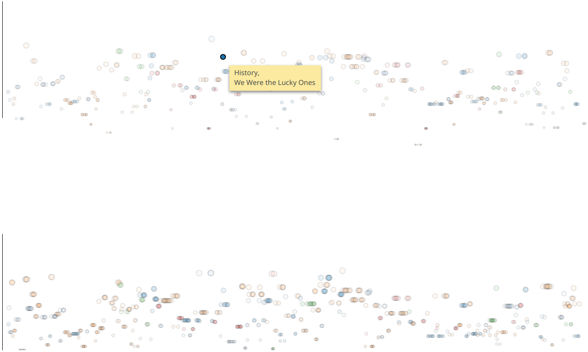

## Overview
This project goes through the entire data mining process in an attempt to better understand book reviews on the Goodreads website. The typical book listed on the Goodreads website has one rating (an average) along with many reviews, and most of the featured books' ratings fall into a limited range, thus it is inherently difficult to understand the meaning of the rating. The goal here is to examine the sentiments of user reviews and book ratings across numerous genres.

This work examines these relationships as a NLP problem, namely, a document level sentiment classification problem. Sentiment predictions are made and then data visualization techniques are used to gain insight about the review-rating-genre relationship.

Two machine learning techniques are used in this project to obtain classifications (imminent). One classification is done using a pretrained RNN with long short term memory units (LSTMs) and with a pretrained Word2Vec model; both were pretrained by Adit Deshpande and may be found [here](https://github.com/adeshpande3/LSTM-Sentiment-Analysis). The Word2Vec model was trained using the word vector generation model [GloVe](https://nlp.stanford.edu/projects/glove/). The word embedding matrix contains 400,000 word vectors with words having dimensionality of 50. The RNN was trained on the IMDb movie review dataset containing 12,500 positive and 12,500 negative reviews.

In addition, a C++ implementation of a Naive Bayes classifier by the [Text Mining Group, Nanjing University of Science & Technology,](https://github.com/NUSTM) is used for classifying.

## TODO
 - Further analysis and visualization are needed to reach conclusions.
 - Port XIA-NB classifier to run on GPU.

## Latest Results
The bar chart was adopted from [Brice Pierre de la Briere's article](https://bl.ocks.org/bricedev/0d95074b6d83a77dc3ad). The red bars represent average book ratings where there were more negative reviews predicted by the LSTM network than positive ones. More blue bars indicate that the Goodreads rating system is representative of user sentiments. (More analysis to come).


These graphs were generated with code adapted from Matrin Chorley's [article](https://bl.ocks.org/martinjc/e4c013dab1fabb2e02e2ee3bc6e1b49d).
The nodes are colored by genre, and their radii vary by the average rating of the title. Positions in the y-direction are given by the rating multiplied by the sentiment (+1 or -1).

                 

This force-directed graph was generated with code adapted from Martin Chorley's article and Mike Bostock's [here](https://bl.ocks.org/mbostock/4600693).


## Dependencies
- Web scraping: [Scrapy](https://scrapy.org) 1.4.0, [Selenium](https://www.seleniumhq.org/) (3.8.0), [PyMySQL](https://pymysql.readthedocs.io/en/latest/) 0.8.0.
- ML and computation: [Pandas](http://pandas.pydata.org) (0.22.0), [NumPy](http://www.numpy.org) (1.14.2), [SQLAlchemy](https://www.sqlalchemy.org/) (1.2.7).
- Dataviz: [D3.js](https://d3js.org/) version 4.

## Usage
1. Install dependencies:
```bash
$ python -m virtualenv goodreads
$ source goodreads/bin/activate
$ pip install -r requirements.txt
```

2. Create SQL table to store Goodreads review data:
```SQL
CREATE TABLE `reviews` (
 `id` int(11) NOT NULL AUTO_INCREMENT,
 `title` varchar(128) NOT NULL,
 `genre` varchar(255) NOT NULL,
 `link_url` varchar(255) NOT NULL,
 `book_url` varchar(255) NOT NULL,
 `user` varchar(32) NOT NULL,
 `reviewDate` varchar(32) NOT NULL,
 `review` text NOT NULL,
 `rating` varchar(24) NOT NULL,
 PRIMARY KEY (`id`)
) ENGINE=InnoDB AUTO_INCREMENT=502 DEFAULT CHARSET=latin1;
```

3. Run Scrapy web crawler:
```bash
$ scrapy crawl goodreads
```
In pipelines.py, you may add certain words to the words_to_filter array in the RequiredFieldsPipeline class to filter the reviews.

4. Choose classification algorithm to run: change to `goodreads/learn` directory and run one of the following.
- LSTM network: `python main.py`
- (TODO) scikit-learn Multinomial Naive Bayes classifier: `python multnb_sklearn.py`
- (TODO) XIA-NB C++ Naive Bayes Classifier: `python nb_xia.py`

5. Visualize data:
..1. Start php server in `goodreads/visualization` directory: `php -S localhost:8000`. If you use `python -m http.server`, you will get the error "Failed to load http://localhost:8000/data.php: No 'Access-Control-Allow-Origin' header is present on the requested resource..."
..2. Open index.html in browser.

## Acknowledgements
1. Adit Deshpande's [article](https://www.oreilly.com/learning/perform-sentiment-analysis-with-lstms-using-tensorflow) on [oreilly.com](www.oreilly.com).

2. The [Naive Bayes Classifier](https://github.com/NUSTM/XIA-NB) by the [Text Mining Group, Nanjing University of Science & Technology,](https://github.com/NUSTM).
